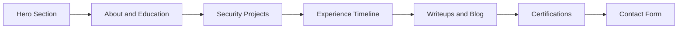
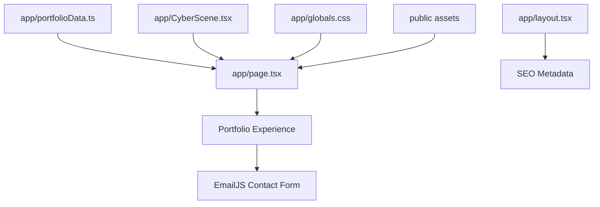
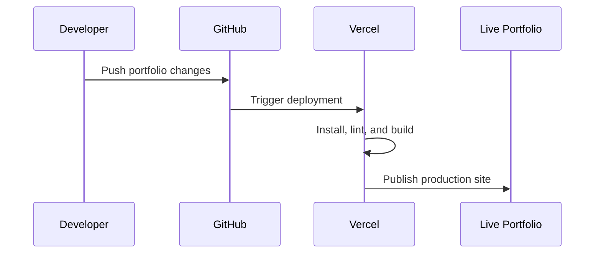

# Dhruv Verma Portfolio

<p align="center">
  <strong>A modern cybersecurity portfolio built with Next.js, React, TypeScript, Tailwind CSS, Three.js, and EmailJS.</strong>
</p>

<p align="center">
  <a href="https://github.com/Dhruv-364/dhruv-portfolio">
    
  </a>
  
  
  
  
</p>

<p align="center">
  <a href="#overview">Overview</a>
  |
  <a href="#highlights">Highlights</a>
  |
  <a href="#tech-stack">Tech Stack</a>
  |
  <a href="#project-map">Project Map</a>
  |
  <a href="#getting-started">Getting Started</a>
  |
  <a href="#content-management">Content</a>
  |
  <a href="#deployment">Deployment</a>
</p>

---

## Overview

This portfolio presents Dhruv Verma's cybersecurity projects, internship experience, certifications, writeups, resume, and contact options in a responsive single-page experience.

The interface is designed around a cyber-themed visual system with an animated 3D background, section navigation, project cards, experience timelines, certification assets, and a working EmailJS contact form.

```text
Repository: https://github.com/Dhruv-364/dhruv-portfolio
```

## Highlights

| Feature | Description |
| --- | --- |
| Responsive Portfolio | Built with the Next.js App Router for a modern single-page portfolio. |
| Cyber Hero Section | Includes resume download, profile image, and security-focused intro. |
| 3D Background | Animated Three.js scene with network nodes, grid motion, and pointer movement. |
| Project Showcase | Covers blue-team, threat-intelligence, vulnerability scanning, IoT, and security engineering work. |
| Experience Timeline | Highlights cybersecurity, SOC, VAPT, IoT, cloud, and network-security internships. |
| Blog and Writeups | Powered by structured local content for easy updates. |
| Certification Gallery | Uses local certification image assets from the `public/certs` directory. |
| Contact Form | Integrated with EmailJS for direct portfolio contact. |
| SEO Metadata | Configured in the root app layout. |
| Centralized Content | Portfolio copy and data are managed from one source file. |

## Tech Stack

| Area | Technology |
| --- | --- |
| Framework | Next.js 16 |
| UI | React 19 |
| Language | TypeScript |
| Styling | Tailwind CSS 4 |
| 3D Visuals | Three.js |
| Contact Form | EmailJS |
| Linting | ESLint 9 with Next.js config |
| Package Manager | npm |

## Experience Flow



## Project Map

<details open>
<summary><strong>View project structure</strong></summary>

```text
.
|-- app
|   |-- CyberScene.tsx       # Animated Three.js background
|   |-- globals.css          # Global styles and visual system
|   |-- layout.tsx           # Root layout and SEO metadata
|   |-- page.tsx             # Main portfolio UI
|   `-- portfolioData.ts     # Portfolio content source
|-- public
|   |-- DhruvVerma-Resume.pdf
|   |-- profile3.png
|   `-- certs
|       |-- comptia.png
|       |-- deloitte.png
|       |-- google.png
|       |-- hackerrank.png
|       `-- tata.png
|-- package.json
|-- package-lock.json
|-- next.config.ts
|-- tsconfig.json
|-- postcss.config.mjs
`-- eslint.config.mjs
```

</details>

## Architecture



## Getting Started

<details open>
<summary><strong>Prerequisites</strong></summary>

Install Node.js and npm. For best results, use a current LTS version of Node.js.

```bash
node --version
npm --version
```

</details>

<details open>
<summary><strong>Install dependencies</strong></summary>

```bash
npm install
```

</details>

<details open>
<summary><strong>Run locally</strong></summary>

```bash
npm run dev
```

Open:

```text
http://localhost:3000
```

</details>

## Available Scripts

| Command | Purpose |
| --- | --- |
| `npm run dev` | Starts the Next.js development server with webpack. |
| `npm run build` | Creates a production build. |
| `npm run start` | Runs the production server after a successful build. |
| `npm run lint` | Runs ESLint checks. |

## Content Management

Most portfolio content is managed from:

```text
app/portfolioData.ts
```

Update this file to edit:

- Navigation labels and section links.
- Hero text, education, contact details, resume link, and profile image.
- Project titles, descriptions, bullet points, and tags.
- Experience entries, timelines, tools, workflows, and impact points.
- Blog posts and writeup content.
- Certification names, organizations, logos, links, and tags.
- Footer and contact content.

The main visual structure is handled in:

```text
app/page.tsx
app/globals.css
app/CyberScene.tsx
```

## Asset Guide

Static files live in the `public` directory and are served from the site root.

| File | Public Path |
| --- | --- |
| `public/profile3.png` | `/profile3.png` |
| `public/DhruvVerma-Resume.pdf` | `/DhruvVerma-Resume.pdf` |
| `public/certs/comptia.png` | `/certs/comptia.png` |
| `public/certs/deloitte.png` | `/certs/deloitte.png` |
| `public/certs/google.png` | `/certs/google.png` |
| `public/certs/hackerrank.png` | `/certs/hackerrank.png` |
| `public/certs/tata.png` | `/certs/tata.png` |

When replacing assets, keep the same filenames if you do not want to update code references.

## Contact Form Setup

The contact form uses `@emailjs/browser` and is wired in:

```text
app/page.tsx
```

The current implementation calls `emailjs.sendForm(...)` from the client. If you create a new EmailJS service or template, update the service ID, template ID, and public key in that file.

For a production portfolio, consider moving form settings into environment variables and validating the EmailJS template fields before deployment.

## SEO

Basic metadata is configured in:

```text
app/layout.tsx
```

It includes:

- Page title.
- Description.
- Keywords.
- Open Graph metadata.

Update this file when changing the portfolio focus, role targets, or public branding.

## Deployment

This project is ready to deploy on Vercel or any platform that supports Next.js.



Recommended Vercel flow:

1. Import the GitHub repository into Vercel.
2. Keep the default Next.js build settings.
3. Use `npm run build` as the build command.
4. Let Vercel detect Next.js automatically.
5. Add environment variables if the contact form is moved out of hardcoded client configuration.
6. Deploy.

## Verification

Before pushing changes, run:

```bash
npm run lint
npm run build
```

These checks help catch TypeScript, linting, framework, and production-build issues.

## Git Workflow

```bash
git status
git add .
git commit -m "Describe your change"
git push origin main
```

## License

This is a personal portfolio project. All resume, profile, certification, and personal-branding assets belong to Dhruv Verma unless otherwise stated.
